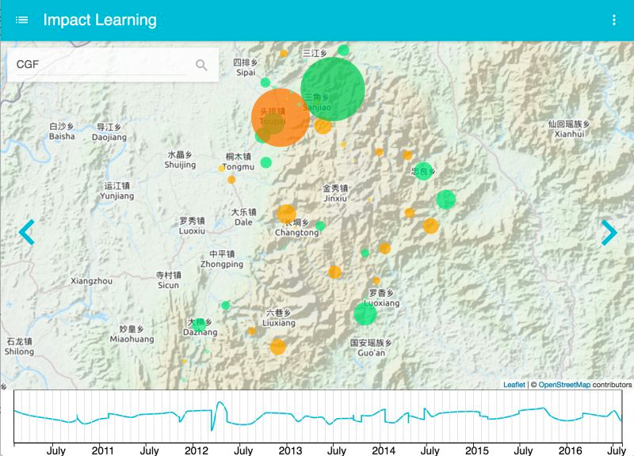
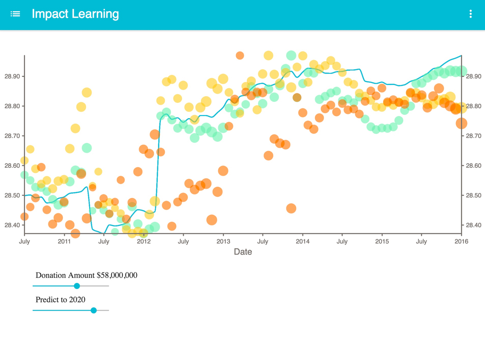

# frontend-demo
Data visualization demo (frontend), it's based on [react-boilerplate](https://github.com/mxstbr/react-boilerplate).

## Core libs used for this project

+ [React.js](https://facebook.github.io/react/)
+ [D3.js](https://d3js.org/)
+ [leaflet.js](http://leafletjs.com/)
+ [socketio.client](https://github.com/socketio/socket.io)
+ [redux](https://github.com/reactjs/redux)
+ [immutable](https://github.com/facebook/immutable-js)
+ others (please see [package.json](package.json))


## Screenshots




# How to Start

## Development

```Shell
$ npm run start
```

Starts the development server running on `http://localhost:3000`

## Generators

```Shell
$ npm run generate
```

Allows you to auto-generate boilerplate code for common parts of your
application, specifically `component`s, `container`s, and `route`s. You can
also run `npm run generate <part>` to skip the first selection. (e.g. `npm run
generate container`)

## Server

### Development

```Shell
$ npm start
```

Starts the development server and makes your application accessible at
`localhost:3000`. Tunnels that server with `ngrok`, which means the website
accessible anywhere! Changes in the application code will be hot-reloaded.

### Production

```Shell
$ npm run start:prod
```

Starts the production server, configured for optimal performance: assets are
minified and served gzipped.

### Port

To change the port the app is accessible at pass the `-p` option to the command
with `--`. E.g. to make the app visible at `localhost:5000`, run the following:
`$ npm start -- -p 5000`

## Building

```Shell
$ npm run build
```

Preps your app for deployment. Optimizes and minifies all files, piping them to
a folder called `build`. Upload the contents of `build` to your web server to
see your work live!

## Testing
See the [Testing docs](docs/testing) for details

## Unit testing

```Shell
$ npm run test
```

Tests your application with the unit tests specified in the `*test.js` files
throughout the application.

### Browsers

To choose the browser to run your unit tests in (Chrome by default), run one of
the following commands:

#### Firefox

```Shell
$ npm run test:firefox
```

#### Safari

```Shell
$ npm run test:safari
```

#### Internet Explorer

*Windows only!*

```Shell
$ npm run test:ie
```

### Watching

```Shell
$ npm run test:watch
```

Watches changes to your application and reruns tests whenever a file changes.

### Remote testing

```Shell
$ npm run start:tunnel
```
Starts the development server and tunnels it with `ngrok`, making the website
available on the entire world. Useful for testing on different devices in different locations!

### Performance testing

```Shell
$ npm run pagespeed
```

With the remote server running (i.e. while `$ npm run start:prod` is running in
another terminal session), enter this command to run Google PageSpeed Insights
and get a performance check right in your terminal!

### Dependency size test

```Shell
$ npm run analyze
```

This command will generate a `stats.json` file from your production build, which
you can upload to the [webpack analyzer](https://webpack.github.io/analyse/). This
analyzer will visualize your dependencies and chunks with detailed statistics
about the bundle size.

## Linting

```Shell
$ npm run lint
```

Lints your JavaScript and CSS.

### JavaScript

```Shell
$ npm run lint:js
```

Only lints your JavaScript.

### CSS

```Shell
$ npm run lint:css
```
